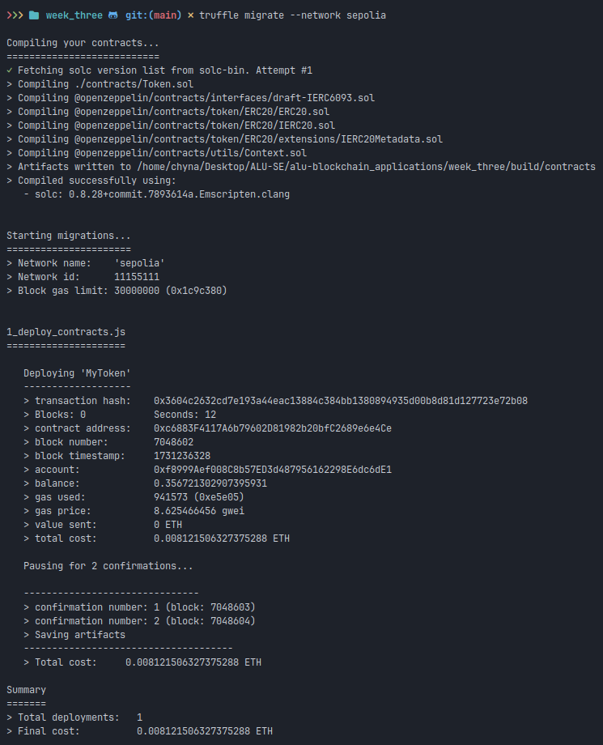
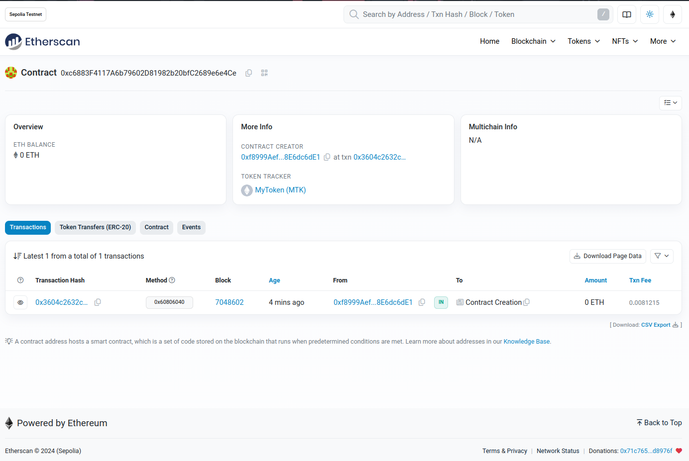
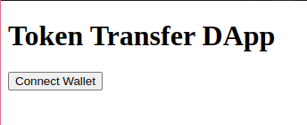
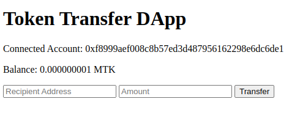

# Token Transfer DApp on Ethereum using Alchemy

This directory contains a decentralized application (DApp) that allows users to transfer tokens between accounts on the Ethereum blockchain using Alchemy as the provider. The DApp consists of a smart contract written in Solidity, a simple web interface using HTML, CSS, and JavaScript, and is deployed on the Sepolia test network.

## Table of Contents

- [Prerequisites](#prerequisites)
- [Setup Instructions](#setup-instructions)
- [Deployment Instructions](#deployment-instructions)
- [Testing Instructions](#testing-instructions)
- [How It Works](#how-it-works)
- [GitHub Repository](#github-repository)
- [Screenshots](#screenshots)

## Prerequisites

Before you begin, ensure you have the following installed:

- Node.js and npm
- Truffle: `npm install -g truffle`
- Ganache CLI: `npm install -g ganache-cli`

## Setup Instructions

1. **Clone the Repository**:

   ```bash
   git clone https://github.com/chyna-gvng/alu-blockchain_applications.git
   cd alu-blockchain_applications/week_three
   ```

2. **Install Dependencies**:

   ```bash
   npm install
   ```

3. **Set Up Environment Variables**:

   Copy the example environment file and update it with your Alchemy API Key and mnemonic phrase.

   ```bash
   cp .env-example .env
   ```

   Edit the `.env` file and add your Alchemy API Key and mnemonic phrase.

   ```env
   ALCHEMY_API_KEY="your_alchemy_api_key"
   MNEMONIC="your mnemonic phrase here"
   ```

## Deployment Instructions

1. **Deploy the Smart Contract**:

   Deploy the smart contract to the Sepolia test network using Truffle.

   ```bash
   truffle migrate --network sepolia
   ```

2. **Modify Contract Address**:

   After deployment, update the contract address in the `src/MyToken.json` file with the address of the deployed contract.

   ```json
   {
     "address": "YOUR_DEPLOYED_CONTRACT_ADDRESS"
   }
   ```

## Testing Instructions

1. **Start Ganache**:

   Start Ganache CLI to run a local blockchain for development testing.

   ```bash
   ganache-cli
   ```

2. **Run Tests**:

   Run the test suite using Truffle.

   ```bash
   truffle test
   ```

## How It Works

### Smart Contract

The smart contract `MyToken` is an ERC20 token contract that allows users to transfer tokens between accounts. The contract is deployed with an initial supply of tokens, which are minted to the deployer's address.

### Frontend

The frontend is a simple web interface that allows users to:

- View their token balance.
- Enter a recipient address and an amount to transfer tokens.
- Initiate the transfer transaction.

### Deployment

The smart contract is deployed to the Sepolia test network using Truffle and Alchemy as the provider. The frontend interacts with the deployed contract to perform token transfers.

## GitHub Repository

[GitHub Repository](https://github.com/chyna-gvng/alu-blockchain_applications/tree/main/week_three)

## Screenshots

### Deployment



### Etherscan



### Frontend



