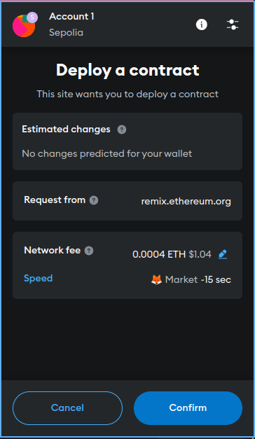

# Smart Contract Assignment: SimpleStorage

Welcome to the **SimpleStorage** smart contract assignment! This project demonstrates the creation, compilation, deployment, and interaction with a basic Solidity smart contract on the Sepolia testnet using Remix IDE and Metamask.

## Table of Contents

1. [Environment Setup](#environment-setup)
2. [Smart Contract Development](#smart-contract-development)
3. [Deployment](#deployment)
4. [Interaction](#interaction)
5. [Screenshots](#screenshots)
6. [Demo](#demo)
7. [Conclusion](#conclusion)

## Environment Setup

### Install remixd

To connect Remix IDE to your local file system, install `remixd` globally using npm:

```sh
npm install -g @remix-project/remixd
```

### Clone Repository

Clone the repository to your local machine:

```sh
git clone https://github.com/chyna-gvng/alu-blockchain_applications.git
cd alu-blockchain_applications/week_two
```

### Create Directories

Create necessary directories for your project:

```sh
mkdir contract demo img
```

### Run remixd

Share your local directory with Remix IDE:

```sh
remixd -s ./ --remix-ide https://remix.ethereum.org
```

## Smart Contract Development

### Write the Smart Contract

Create a new Solidity file `SimpleStorage.sol` in the `contract` directory:

```solidity
// SPDX-License-Identifier: MIT
pragma solidity ^0.8.0;

contract SimpleStorage {
    uint256 storedData;

    function set(uint256 x) public {
        storedData = x;
    }

    function get() public view returns (uint256) {
        return storedData;
    }
}
```

### Compile the Contract

1. Open [Remix IDE](https://remix.ethereum.org/).
2. Activate the `remixd` plugin and connect to the remote workspace.
3. Go to the "Solidity Compiler" tab.
4. Select the appropriate compiler version (e.g., 0.8.0).
5. Click "Compile SimpleStorage.sol".

**Screenshot**: [compilation.png](img/compilation.png)

## Deployment

### Obtain Test ETH

1. Go to [Sepolia Faucet](https://sepoliafaucet.com/) or [Google Cloud Sepolia Faucet](https://cloud.google.com/application/web3/faucet/ethereum/sepolia).
2. Enter your Metamask wallet address and request test ETH.

### Deploy the Contract

1. Go to the "Deploy & Run Transactions" tab in Remix IDE.
2. Select "Injected Provider - Metamask" as the environment.
3. Ensure Metamask is connected to the Sepolia testnet.
4. Click "Deploy".
5. Confirm the transaction in Metamask.

**Screenshots**:
- [metamask-connect.png](img/metamask-connect.png)
- [metamask-pre-deployment.png](img/metamask-pre-deployment.png)
- [metamask-in-process.png](img/metamask-in-process.png)
- [metamask-post-deployment.png](img/metamask-post-deployment.png)
- [deployment.png](img/deployment.png)

## Interaction

### Interact with the Deployed Contract

1. **Set Function**: Store a value in the contract.
2. **Get Function**: Retrieve the stored value.

**GIF of interaction**: [interaction.gif](demo/interaction.gif)

## Screenshots

### Contract Creation


### Compilation


### Metamask Connect


### Metamask Pre Deployment


### Metamask In Process



### Metamask Post Deployment


### Deployment


## Demo

### Interaction GIF


## Conclusion

This guide covers the process of setting up the environment, writing, compiling, deploying, and interacting with the **SimpleStorage** smart contract. All steps are documented with screenshots and a GIF of the interaction. By following this structured approach, you can ensure a smooth and successful completion of your assignment.

Happy coding! 🚀
